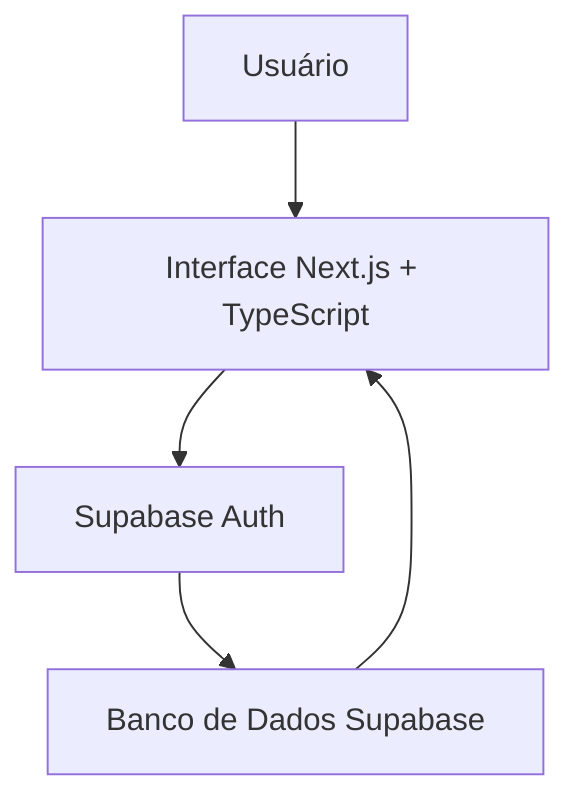
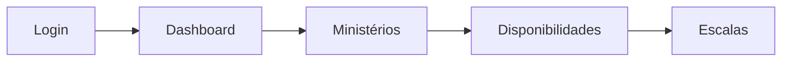
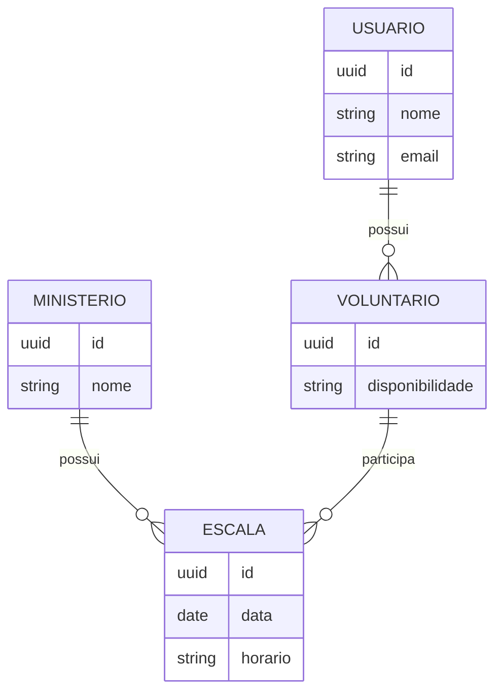
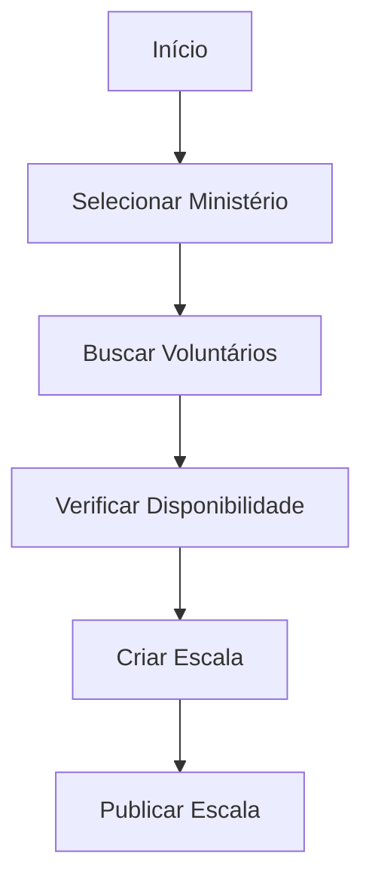

# MinistryHub 🗓️⛪

<p align="center">


</p>

<h1 align="center">MinistryHub</h1>

<p align="center">
Automação inteligente e gestão estratégica de escalas para ministérios e igrejas.
</p>

---

# 📌 Sobre o projeto

O MinistryHub é uma plataforma web desenvolvida como Trabalho de Conclusão de Curso (TCC) com o objetivo de modernizar a organização interna de igrejas e ministérios.

O projeto centraliza a comunicação entre líderes e voluntários, substituindo processos manuais, como apresentações, planilhas, imagens e mensagens dispersas, por uma solução digital intuitiva e acessível.

A plataforma foi projetada para reduzir erros humanos, agilizar a criação de escalas e facilitar o gerenciamento das equipes.

---

# 🎯 Objetivo

Criar um ambiente centralizado que permita:

- 👥 Gerenciar voluntários;
- ⛪ Organizar ministérios;
- 📅 Criar e visualizar escalas;
- 🔒 Controlar acessos dos usuários;
- ☁️ Centralizar as informações;
- 📱 Disponibilizar uma interface moderna e responsiva.

---

# ⚙️ Como funciona?

O sistema simplifica a criação das escalas através de um fluxo organizado:

1. O usuário realiza o login.
2. O sistema identifica seu perfil.
3. Os voluntários informam suas disponibilidades.
4. Os líderes organizam as escalas.
5. As informações ficam disponíveis para toda a equipe.

---

# 📐 Diagrama 1 - Arquitetura Geral



---

# 📊 Diagrama 2 - Fluxo de Utilização



---

# 🗄️ Diagrama 3 - Entidade Relacionamento



---

# 🔄 Diagrama 4 - Fluxo de Criação da Escala



---

# 🛠️ Tecnologias Utilizadas

### Frontend

- Next.js
- React
- TypeScript

### Banco de Dados

- Supabase

### Ferramentas

- Git
- GitHub
- PNPM

---

# 📂 Estrutura do Projeto

```bash
public/

src/

.gitignore

components.json

next.config.ts

package.json

pnpm-lock.yaml

pnpm-workspace.yaml

postcss.config.mjs

tsconfig.json
```

---

# 🚀 Executando o projeto

Clone o repositório:

```bash
git clone https://github.com/Guilhermbsilva/tcc2026.git
```

Entre na pasta:

```bash
cd tcc2026
```

Instale as dependências:

```bash
pnpm install
```

Execute o projeto:

```bash
pnpm dev
```

Abra no navegador:

```bash
http://localhost:3000
```

---

# 🎓 Projeto Acadêmico

Projeto desenvolvido como Trabalho de Conclusão de Curso (TCC) do 3º Ano A do  Colégio Técnico Bento Quirino, aplicando conceitos de:

- Engenharia de Software
- Banco de Dados
- Arquitetura de Sistemas
- Desenvolvimento Web
- UX/UI
- Computação em Nuvem

---

# 👨‍💻 Equipe

Projeto desenvolvido pela equipe do TCC 2026.

Davi Tavares Lima

Guilherme Barroso da Silva

Guilherme Martins Mosca da Silva

Matheus Albieri Forim

Vitor Gabriel Ferreira Costa


#📄 Termos de Uso e Compartilhamento


Autores: Davi Tavares Lima, Guilherme Barroso da Silva, Guilherme Mosca Martins da Silva, Matheus Albieri Forim, Vitor Gabriel Ferreira Costa

Orientador: Mateus Redivo

Projeto: MinistryHub, TCC Técnico em Informática, Colégio Técnico Bento Quirino, 2026


©️ 2026 Davi Tavares Lima, Guilherme Barroso da Silva, Guilherme Mosca Martins da Silva, Matheus Albieri Forim e Vitor Gabriel Ferreira Costa. Todos os direitos reservados, exceto o que está expressamente permitido abaixo.


Permitido


* Consultar e estudar o código para fins educacionais.

* Uso para avaliação do TCC e apresentação acadêmica.

* Uso não comercial por terceiros, desde que respeitadas as condições de crédito abaixo.


Condições


1. Crédito obrigatório: qualquer uso, cópia, adaptação ou divulgação deve citar os autores pelo nome e incluir link para este repositório.

2. Sem fins lucrativos: é proibido usar, vender, licenciar ou oferecer este código (ou derivados) como produto ou serviço comercial sem contratar os autores previamente.

3. Uso institucional: o uso pela instituição de ensino além da avaliação do TCC (outros projetos, sistemas internos, divulgação) depende de autorização prévia e por escrito dos autores.

4. Derivados: trabalhos derivados devem manter este aviso e indicar o que foi alterado.


Contato


Para solicitar autorização ou contratar os autores:


* Davi Tavares Lima: https://www.linkedin.com/in/davi-tavares-671a91319

* Guilherme Barroso da Silva: https://www.linkedin.com/in/guilherme-barroso-da-silva-488227346

* Guilherme Mosca Martins da Silva: https://www.linkedin.com/in/guilherme-mosca10

* Matheus Albieri Forim: https://www.linkedin.com/in/matheus-forim-ab3aa8441

* Vitor Gabriel Ferreira Costa: https://www.linkedin.com/in/vitor-costa-999035329


Isenção de garantia


O software é fornecido “como está”, sem garantias de qualquer tipo. 

